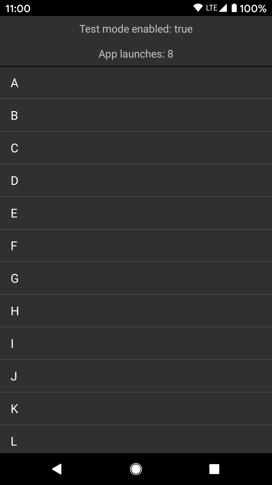

### Appium Test Helper Android  
&nbsp;   
  
Sample app hooked up to default Appium Bootstrap configuration.  
It shows how you can detect test mode in [Appium Test Helper Android](https://github.com/KamilSucharski/appium_test_helper_android)  
  
[Download now on Google Play Store](https://play.google.com/store/apps/details?id=com.sengami.sample_testable_app_android)